# DevSecOps Threat Monitor for LogiFlow


## 🌟 What is this repository?

Welcome to the **LogiFlow Security Command Center**.
This project implements a complete **DevSecOps monitoring and validation layer** for a production-style distributed system, embedding security in every stage of the lifecycle.

> 🛡️ Goal: demonstrate end-to-end applied security (code, dependencies, containers, APIs, and runtime) with executable evidence.

**Institution:** Escuela Colombiana de Ingenieria Julio Garavito  
**Course:** SPTI - Seguridad y Privacidad de Tecnologías de la Información  
**Professor:** Javier Ivan Toquica Barrera  
**Team:** Andersson David Sánchez Méndez, Cristian Santiago Pedraza Rodriguez, Jeisson David Sánchez Gómez

## 🧭 Table of Contents

- [🌈 DevSecOps Pipeline (Visual)](#-devsecops-pipeline-visual)
- [🗂️ Repository Map](#️-repository-map)
- [🚀 Quick Start](#-quick-start)
- [🎬 Demo Step by Step](#-demo-step-by-step)
- [📡 Monitoring Validation Guide](#-monitoring-validation-guide)
- [🏗️ Architecture Comparison](#️-architecture-comparison)
- [✅ Deliverables](#-deliverables)
- [📘 IEEE Paper](#-ieee-paper)
- [📁 Evidence and Reporting](#-evidence-and-reporting)
- [💡 Operational Recommendations](#-operational-recommendations)
- [📄 License](#-license)

## 🌈 DevSecOps Pipeline (Visual)

```mermaid
flowchart LR
  C1([💻 Code Commit]) --> SAST[🔎 SAST\nCodeQL + Semgrep]
  SAST --> SCA[📦 SCA\nnpm audit + Snyk]
  SCA --> SECRETS[🧬 Secrets Detection\nGitLeaks + TruffleHog]
  SECRETS --> CONTAINER[🐳 Container Security\nBuild + Trivy]
  CONTAINER --> DAST[🌐 DAST\nOWASP ZAP]
  DAST --> DEPLOY[🚀 Deploy]
  DEPLOY --> OBS[📡 Runtime Monitoring\nFalco + Prometheus + Loki + Grafana]

  subgraph SHIFTLEFT[Shift-Left Security]
    SAST
    SCA
    SECRETS
  end

  subgraph SHIFTOPS[Shift-Right Observability]
    DAST
    DEPLOY
    OBS
  end

  classDef start fill:#D6F5FF,stroke:#0EA5E9,stroke-width:2px,color:#0B3954
  classDef sec fill:#FFF4CC,stroke:#F59E0B,stroke-width:2px,color:#6B3F00
  classDef runtime fill:#DBFCE7,stroke:#16A34A,stroke-width:2px,color:#14532D
  classDef stage fill:#F3E8FF,stroke:#9333EA,stroke-width:2px,color:#581C87

  class C1 start
  class SAST,SCA,SECRETS,CONTAINER,DAST sec
  class DEPLOY,OBS runtime
  class SHIFTLEFT,SHIFTOPS stage
```



## 🗂️ Repository Map

- `architectures/unsecure`: attack surface baseline, vulnerability register, and STRIDE model.
- `architectures/secure`: remediated architecture, controls matrix, and verification guidance.
- `monitoring`: deployment and configuration for Falco, Prometheus, Grafana, Loki, Promtail, Tempo, and OpenTelemetry Collector.
- `dast`: OWASP ZAP scan configuration (baseline/full) and report parser.
- `sast`, `sca`, `secrets-detection`: static and supply-chain security controls.
- `tests`: formal test plan, penetration scripts, and evidence placeholders.
- `docs`: IEEE paper structure, final presentation outline, and SPTI mapping.

## 🚀 Quick Start

### 1) Clone and start monitoring stack

```bash
git clone https://github.com/AnderssonProgramming/devsecops-threat-monitor
cd devsecops-threat-monitor/monitoring
docker compose up -d
```

### 2) Create Docker network (if missing)

```bash
docker network create logiflow-security-net
```

## 🎬 Demo Step by Step

Watch the full demo video on YouTube:

- [LogiFlow DevSecOps Security Demo](https://youtu.be/esmaYBYShMA)

Before running the scripts, make sure LogiFlow services are up:

```bash
cd ../logiflow-cybersecurity-seminar
docker compose up -d
cd ../devsecops-threat-monitor
```

### 1) 🔐 Authentication bypass checks

```bash
bash tests/penetration/auth-bypass-tests.sh
node tests/penetration/socket-injection-tests.js
```

### 2) ⚡ Webhook DoS / rate-limit validation

```bash
bash tests/penetration/rate-limit-tests.sh
```

### 3) 🌐 DAST scan + results gating

```bash
export LOGIFLOW_GATEWAY_URL=http://localhost:3002/api/v1/health
bash dast/scripts/run-dast.sh
node dast/scripts/parse-zap-report.js
```

### 4) 📦 SCA across all backend services

```bash
bash sca/audit-all.sh
```

### 5) 🧠 Runtime anomaly detection (Falco)

Trigger suspicious behavior inside a target container and validate alerts in Grafana (<http://localhost:3030>) and Loki.

## 📡 Monitoring Validation Guide

### Prometheus (<http://localhost:9090>)

Recommended starter queries:

- `up`
- `up{job="logiflow-gateway"}`
- `up{job="logiflow-realtime"}`
- `rate(logiflow_auth_failures_total[5m])`

If `up` returns `1` for relevant jobs, scraping is healthy.

### Grafana (<http://localhost:3030>)

- Login:
  - Username: `admin`
  - Password: value from `GRAFANA_ADMIN_PASSWORD`
- Go to Dashboards -> LogiFlow Security.
- Verify dashboard panels, metric series, and alert feeds.

### Loki (<http://localhost:3100>)

The `/` route may return `404` by design. Use health/API endpoints:

- <http://localhost:3100/ready>
- <http://localhost:3100/loki/api/v1/labels>

### Tempo Traces (<http://localhost:3200>)

Use these quick checks to confirm trace ingestion:

- <http://localhost:3200/ready>
- <http://localhost:3200/api/search?limit=5>

If traces are flowing, `/api/search` returns recent `traceID` entries with root service names (for example `logiflow-gateway`).

### 🎥 Quick Demo Storyboard (Video)

1. Show monitoring stack up (`docker ps` with grafana/prometheus/loki/promtail/falco/tempo/otel-collector).
2. Show LogiFlow stack up (`docker compose ps` in logiflow repo).
3. Run TC-01, TC-02, TC-03 and explain PASS/FAIL criteria.
4. Run ZAP baseline + parser and show artifacts in `dast/reports`.
5. Correlate one test execution with Grafana panels.

## 🏗️ Architecture Comparison

- Unsecure architecture: [architectures/unsecure](architectures/unsecure/README.md)
- Secure architecture: [architectures/secure](architectures/secure/README.md)
- Threat model (STRIDE): [architectures/unsecure/threat-model.md](architectures/unsecure/threat-model.md)
- Controls matrix (NIST CSF): [architectures/secure/controls-matrix.md](architectures/secure/controls-matrix.md)

## ✅ Deliverables

- [x] April 6 - Security test plan and evaluation criteria
- [x] April 6 - Presentation outline and demo-ready scripts
- [x] April 8 - IEEE paper outline
- [x] April 11 - Final integrated DevSecOps monitoring package

## 📘 IEEE Paper

Access the final report here:

- [IEEE Final Report (PDF)](docs/ieee-paper.pdf)

## 📁 Evidence and Reporting

- Store DAST reports in `dast/reports`.
- Store test logs/screenshots in `tests/results`.
- Use GitHub Actions artifacts as evidence in the final presentation.

## 💡 Operational Recommendations

- Use `.env` (based on `.env.example`) to centralize credentials and target URLs.
- Ensure Docker Desktop is running before executing scripts.
- If LogiFlow ports change, update `LOGIFLOW_GATEWAY_URL` for DAST.
- Keep key evidence versioned for academic and technical traceability.

## 📄 License

MIT License. See [LICENSE](LICENSE).
