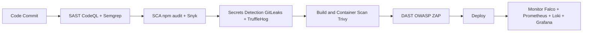

# DevSecOps Threat Monitor for LogiFlow


**Institution:** Escuela Colombiana de Ingenieria Julio Garavito  
**Course:** SPTI - Seguridad y Privacidad de Tecnologias de la Informacion  
**Professor:** Javier Ivan Toquica Barrera  
**Team:** Andersson David Sanchez Mendez, Cristian Santiago Pedraza Rodriguez, Jeisson David Sanchez Gomez

This repository implements a complete DevSecOps security monitoring layer for the LogiFlow production-style distributed system.

## DevSecOps Pipeline



## Repository Map

- `architectures/unsecure`: attack surface baseline with vulnerability register and STRIDE model.
- `architectures/secure`: remediated architecture, controls matrix, and verification guidance.
- `monitoring`: Falco, Prometheus, Grafana, Loki, and Promtail deployment/configuration.
- `dast`: OWASP ZAP baseline/full scan configuration and report parser.
- `sast`, `sca`, `secrets-detection`: static and supply-chain security controls.
- `tests`: formal plan, penetration scripts, and evidence placeholders.
- `docs`: IEEE paper and final presentation outlines, plus SPTI mapping.

## Quick Start

```bash
git clone https://github.com/AnderssonProgramming/devsecops-threat-monitor
cd devsecops-threat-monitor/monitoring
docker compose up -d
```

Before startup, ensure the Docker network exists:

```bash
docker network create logiflow-security-net
```

## Demo

### 1) Authentication bypass checks

```bash
bash tests/penetration/auth-bypass-tests.sh
node tests/penetration/socket-injection-tests.js
```

### 2) Webhook DoS / rate-limit validation

```bash
bash tests/penetration/rate-limit-tests.sh
```

### 3) DAST scan and report gating

```bash
bash dast/scripts/run-dast.sh
node dast/scripts/parse-zap-report.js
```

### 4) SCA across all backend services

```bash
bash sca/audit-all.sh
```

### 5) Runtime anomaly detection (Falco)

Trigger suspicious process behavior inside a target container and verify alerts in Grafana (http://localhost:3030) and Loki.

## Architecture Comparison

- Unsecure architecture: [architectures/unsecure](architectures/unsecure/README.md)
- Secure architecture: [architectures/secure](architectures/secure/README.md)
- Threat model (STRIDE): [architectures/unsecure/threat-model.md](architectures/unsecure/threat-model.md)
- Controls matrix (NIST CSF): [architectures/secure/controls-matrix.md](architectures/secure/controls-matrix.md)

## Deliverables

- [x] April 6 - Security test plan and evaluation criteria
- [x] April 6 - Presentation outline and demo-ready scripts
- [x] April 8 - IEEE paper outline
- [x] April 11 - Final integrated DevSecOps monitoring package

## Evidence and Reporting

- Store DAST reports in `dast/reports`.
- Store test logs/screenshots in `tests/results`.
- Use GitHub Actions artifacts for pipeline evidence in the final presentation.

## License

MIT License. See [LICENSE](LICENSE).
