# DevSecOps Threat Monitor

> Continuous Monitoring and Threat Detection in Production  
> Course: IT Security and Privacy (SPTI)  
> Professor: Javier Ivan Toquica Barrera  
> Institution: Escuela Colombiana de Ingenieria Julio Garavito

## Seminar Theme

**Continuous Monitoring and Threat Detection in Production (DevSecOps Focus)**

This repository contains the working progress for a seminar designed for the SPTI course.  
The core idea is simple: **security is not a one-time gate; it is a production-time capability.**

---

## Why This Topic Matters

Modern systems are deployed many times per day, run on distributed infrastructure, and depend on third-party packages, APIs, and cloud services. Traditional security models that rely only on pre-release checks are not enough.

In DevSecOps, we need to answer in real time:

- Are we under attack right now?
- How fast can we detect suspicious behavior?
- Can we respond without stopping business operations?
- Are we learning from incidents and improving detections continuously?

---

## Seminar Goal

Build a practical understanding of how to design and operate a **continuous security monitoring capability** for production environments, integrating:

- Secure SDLC and shift-left controls
- Runtime observability and security telemetry
- Detection engineering and alert quality
- Incident response and feedback loops

---

## Learning Objectives

By the end of the seminar, participants should be able to:

1. Explain the difference between preventive controls and detective controls in DevSecOps.
2. Describe an end-to-end threat monitoring architecture for production.
3. Identify high-value telemetry sources (application, infrastructure, identity, network, and supply chain).
4. Define actionable detection rules mapped to attacker behavior.
5. Use meaningful KPIs to evaluate detection and response maturity.
6. Propose an incremental roadmap for implementing continuous monitoring in a real project.

---

## Problem Statement

Teams often deploy fast but monitor weakly. Common gaps include:

- Logs exist but are not normalized or correlated.
- Alerts are noisy and not tied to business risk.
- There is no clear ownership for triage and response.
- Security findings from production do not feed back into development.

Result: **high dwell time, delayed containment, and repeated incidents.**

---

## DevSecOps Monitoring Architecture (Reference)

```mermaid
flowchart LR
	A[Code + IaC + Dependencies] --> B[CI Security Gates\nSAST/SCA/Secrets]
	B --> C[Build + Sign + SBOM]
	C --> D[CD + Policy Enforcement]
	D --> E[Production Workloads\nApps + APIs + Containers + Cloud]

	E --> F[Telemetry Collection\nLogs Metrics Traces Events]
	F --> G[Security Data Platform\nSIEM + Data Lake + Correlation]
	G --> H[Detection Engine\nRules + Anomaly + Threat Intel]
	H --> I[Alert Triage + SOAR Playbooks]
	I --> J[Incident Response\nContainment Eradication Recovery]
	J --> K[Post-Incident Review + Backlog]
	K --> A
```

### Key Principle

Security in DevSecOps is a **closed loop**:

- Build secure software.
- Monitor runtime behavior.
- Detect attacks quickly.
- Respond and recover.
- Feed lessons learned back into engineering.

---

## Threat Scenarios To Cover In Seminar

1. Credential abuse on CI/CD or cloud console accounts.
2. API abuse (token replay, brute force, unusual request patterns).
3. Container compromise (unexpected process execution, reverse shell behavior).
4. Dependency/supply-chain compromise (malicious package update behavior).
5. Data exfiltration via unusual outbound traffic.
6. Privilege escalation in cloud IAM or Kubernetes RBAC.

For each scenario, include:

- Attack path
- Required telemetry
- Detection logic
- Response action
- Preventive hardening recommendations

---

## Detection Engineering Workflow

1. Define the threat hypothesis (what attacker behavior to detect).
2. Map telemetry fields and event sources.
3. Build a draft detection rule (high signal, low noise).
4. Test with safe simulations (atomic techniques, controlled lab events).
5. Tune thresholds and reduce false positives.
6. Add runbook context (severity, owner, response steps).
7. Measure detection quality and iterate.

---

## Minimum Telemetry Baseline

- **Identity and access**: login success/failure, MFA events, privilege changes.
- **Application layer**: authentication events, authorization failures, sensitive endpoint access.
- **Infrastructure**: host/container process events, file changes in critical paths.
- **Network**: egress anomalies, uncommon destinations, DNS anomalies.
- **Pipeline security**: build provenance, signature verification, artifact promotion events.
- **Cloud control plane**: policy changes, security group changes, key/secret access.

---

## KPIs for Continuous Monitoring

- **MTTD** (Mean Time to Detect)
- **MTTR** (Mean Time to Respond/Recover)
- Alert precision and false-positive rate
- Coverage by threat scenario (detection matrix)
- % critical services with complete telemetry baseline
- % alerts with documented runbooks
- Incident recurrence rate (same root cause)

---

## 30-60-90 Day Implementation Roadmap

### Days 1-30: Foundations

- Define crown jewels and threat scenarios.
- Standardize logging schema and retention.
- Enable baseline detections for identity, IAM changes, and critical APIs.
- Assign on-call ownership and escalation paths.

### Days 31-60: Detection Quality

- Correlate multi-source events.
- Add detection tuning workflow and quality metrics.
- Create incident playbooks for top threats.
- Start periodic attack simulations.

### Days 61-90: Continuous Improvement

- Integrate post-incident findings into backlog.
- Expand coverage to supply chain and data exfiltration.
- Automate triage/containment for low-risk repetitive alerts.
- Publish monthly security observability scorecard.

---

## Suggested Tooling Stack (Technology-Agnostic)

- CI/CD security: GitHub Advanced Security, GitLab Security, or equivalent
- SIEM/analytics: Microsoft Sentinel, Splunk, Elastic, or Chronicle
- Runtime detection: Falco, cloud-native threat detection, EDR/XDR signals
- SOAR/orchestration: native SIEM playbooks or external automation
- Visualization: operational security dashboards for engineering + SOC

The strategy is more important than any specific vendor.

---

## Presentation Deliverables In This Repository

- A complete seminar narrative and conceptual framework (this README)
- A presentation script with timing and speaking points: `docs/seminar-script.md`
- An operational runbook for production detection and response: `docs/production-monitoring-runbook.md`

---

## Team

- Andersson David Sanchez Mendez
- Cristian Santiago Pedraza Rodriguez
- Jeisson David Sanchez Gomez

---

## Academic Context

- Course: Seguridad y Privacidad de TI (SPTI)
- Professor: Javier Ivan Toquica Barrera
- Institution: Escuela Colombiana de Ingenieria Julio Garavito

---

## References

1. NIST. (2018). *Framework for Improving Critical Infrastructure Cybersecurity (Version 1.1).* https://www.nist.gov/cyberframework
2. NIST. (2012). *Computer Security Incident Handling Guide (SP 800-61 Rev. 2).* https://csrc.nist.gov/publications/detail/sp/800-61/rev-2/final
3. CISA. (2023). *Best Practices for Event Logging and Threat Detection.* https://www.cisa.gov/resources-tools/resources/best-practices-event-logging-and-threat-detection
4. OWASP Foundation. (2023). *OWASP Top 10:2021.* https://owasp.org/www-project-top-ten/
5. MITRE. (n.d.). *ATT&CK Knowledge Base.* https://attack.mitre.org/
6. Google Cloud. (2020). *BeyondProd: A New Approach to Cloud and Endpoint Security.* https://cloud.google.com/beyondprod
7. CNCF TAG Security. (2022). *Cloud Native Security Whitepaper.* https://github.com/cncf/tag-security/tree/main/community/whitepaper
8. OpenTelemetry. (n.d.). *OpenTelemetry Documentation.* https://opentelemetry.io/docs/
9. SRE Books. (2016). *Site Reliability Engineering: How Google Runs Production Systems.* https://sre.google/books/
10. ISO/IEC. (2022). *ISO/IEC 27001 Information Security Management Systems.* https://www.iso.org/isoiec-27001-information-security.html

---

## License

This project is distributed under the terms of the license provided in `LICENSE`.