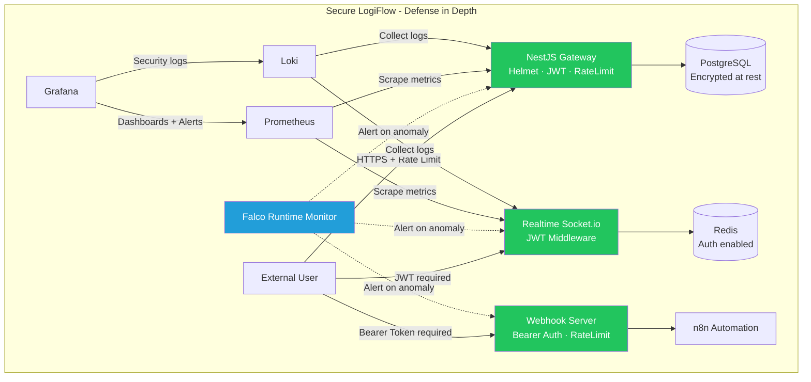

# Secure Architecture Diagram

```mermaid
graph TD
    subgraph SECURE["Secure LogiFlow - Defense in Depth"]
        EXT[External User]

        EXT -->|"HTTPS + Rate Limit"| GW[NestJS Gateway\nHelmet · JWT · RateLimit]
        EXT -->|"JWT required"| RT[Realtime Socket.io\nJWT Middleware]
        EXT -->|"Bearer Token required"| WH[Webhook Server\nBearer Auth · RateLimit]

        GW --> DB[(PostgreSQL\nEncrypted at rest)]
        RT --> REDIS[(Redis\nAuth enabled)]
        WH --> N8N[n8n Automation]

        FALCO[Falco Runtime Monitor] -.->|"Alert on anomaly"| GW
        FALCO -.->|"Alert on anomaly"| RT
        FALCO -.->|"Alert on anomaly"| WH

        PROM[Prometheus] -->|"Scrape metrics"| GW
        PROM -->|"Scrape metrics"| RT
        LOKI[Loki] -->|"Collect logs"| GW
        LOKI -->|"Collect logs"| RT
        GRAFANA[Grafana] -->|"Dashboards + Alerts"| PROM
        GRAFANA -->|"Security logs"| LOKI

        style GW fill:#22c55e,color:#ffffff
        style RT fill:#22c55e,color:#ffffff
        style WH fill:#22c55e,color:#ffffff
        style FALCO fill:#229ed9,color:#ffffff
    end
```
