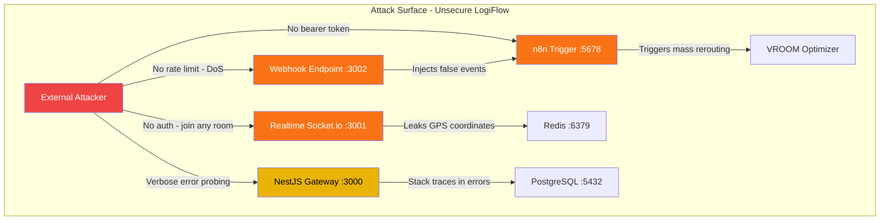

# Unsecure Architecture Diagram

```mermaid
graph TD
    subgraph ATTACK_SURFACE["Attack Surface - Unsecure LogiFlow"]
        EXT[External Attacker]

        EXT -->|"No auth - join any room"| RT[Realtime Socket.io :3001]
        EXT -->|"No rate limit - DoS"| WH[Webhook Endpoint :3002]
        EXT -->|"No bearer token"| N8N[n8n Trigger :5678]

        RT -->|"Leaks GPS coordinates"| REDIS[Redis :6379]
        EXT -->|"Verbose error probing"| GW[NestJS Gateway :3000]
        GW -->|"Stack traces in errors"| DB[PostgreSQL :5432]
        WH -->|"Injects false events"| N8N
        N8N -->|"Triggers mass rerouting"| OPT[VROOM Optimizer]

        style EXT fill:#ef4444,color:#ffffff
        style RT fill:#f97316,color:#ffffff
        style WH fill:#f97316,color:#ffffff
        style N8N fill:#f97316,color:#ffffff
        style GW fill:#eab308,color:#000000
    end
```
